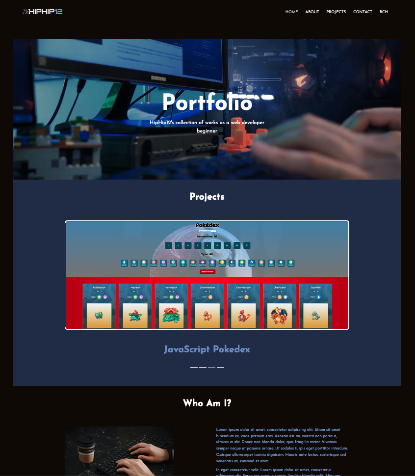
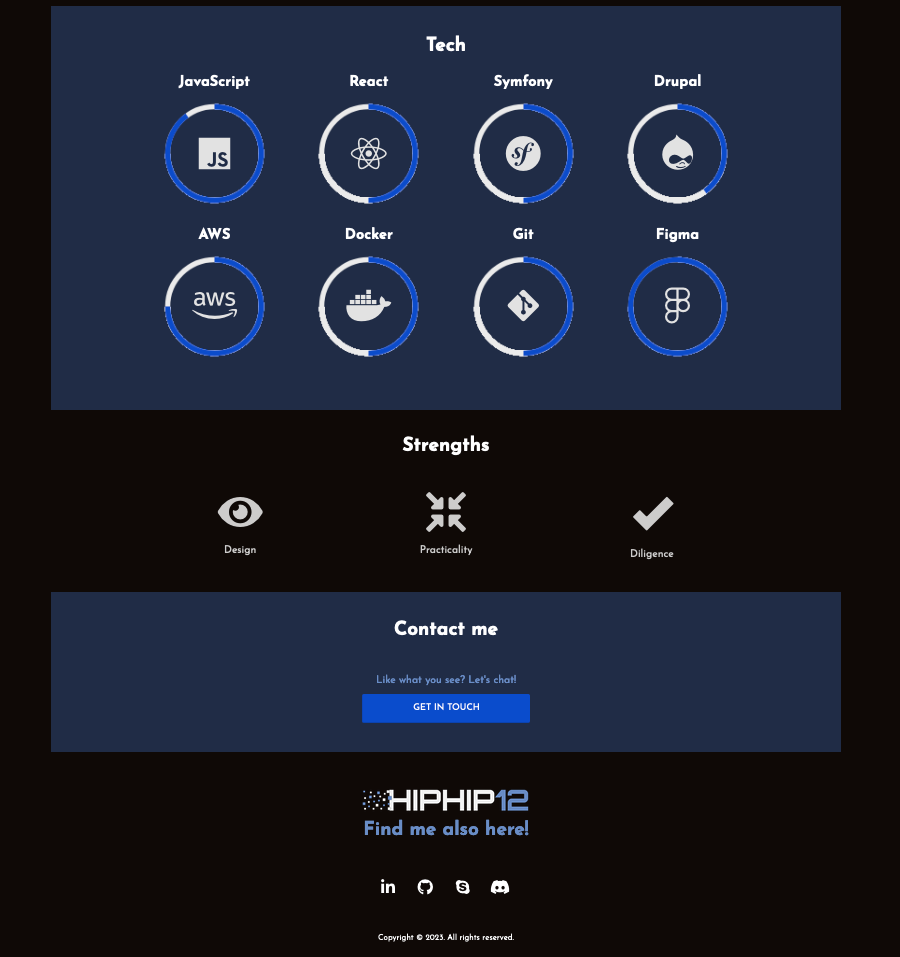
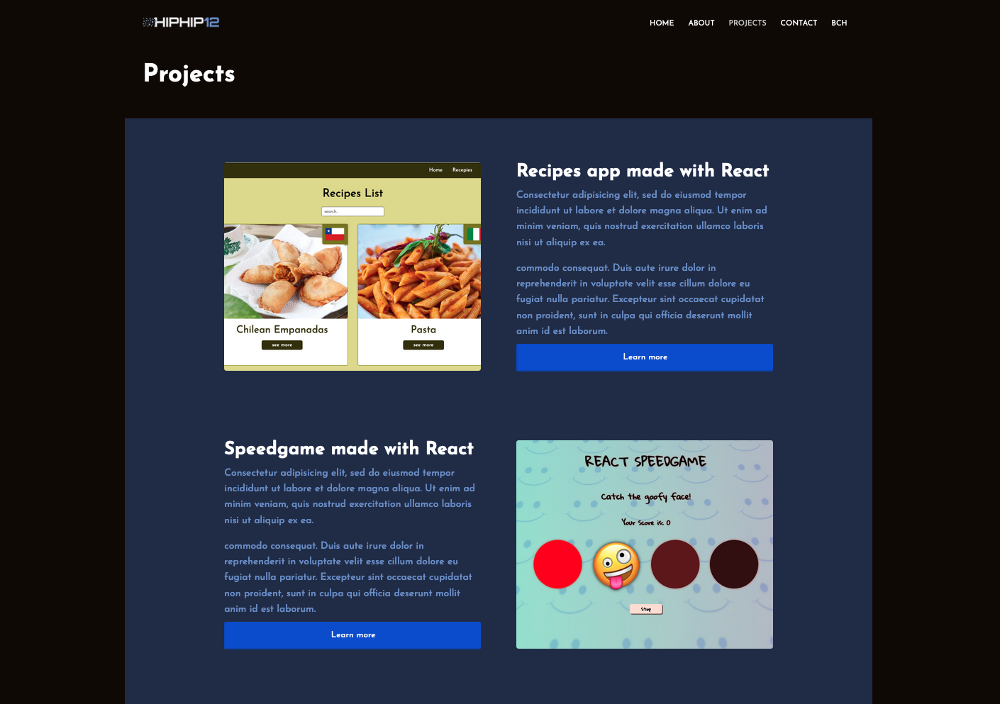
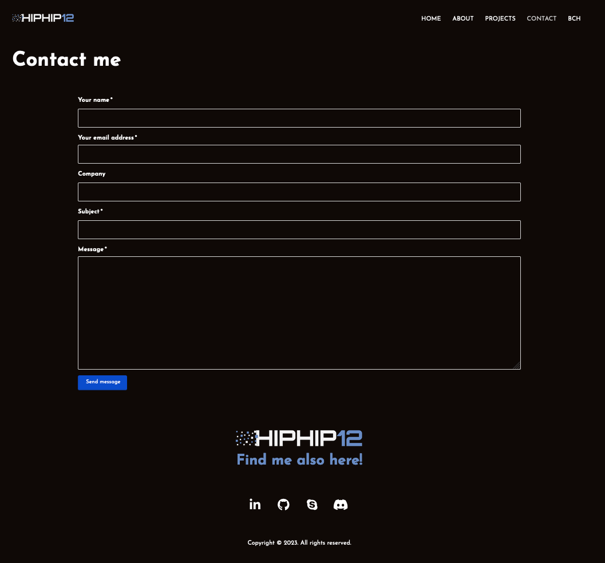

# Porfolio Website exmaple made with Drupal

## Description

This is a portfolio website example made using Drupal 10's core modules + DXPR Themes and Builder Modules, customizing displayed content using the various options these tools provide. This project was an assigment from the program in Web Development [@Helsinki Business School](https://en.bc.fi) (Oct 2023).

The installation and local development were made using [Lando](https://docs.lando.dev/drupal/getting-started.html). Backend tools used included Docker and Phpmyadmin.

## Set up

Lando:

```shell
lando composer install
lando db-import drupal10.2023-10-12-1697095881.sql.gz  --no-wipe
lando drush cim
lando start
```

For alternatives, see [official Drupal docs](https://www.drupal.org/docs/getting-started/installing-drupal).


## Screenshots

### Front page:



### Projects page:


### Contact:


## Credits

The task itself and guidance were provided by the excellent [Santosh Kalwar](https://github.com/kalwar) from the Helsinki Business College.

Hero banner's video is from [youtube](https://www.youtube.com/watch?v=QKKujrm8O7M).

Pictures for "About" page and "Coming Soon" section, are courtesy of [Unsplash](https://unsplash.com/).

Picture for "Who Am I" section, is courtesy of [Pexels](https://www.pexels.com).

### Drupal Modules

- [DXPR Themes](https://www.drupal.org/project/dxpr_theme)
- [DXPR Builder](https://www.drupal.org/project/dxpr_builder)
- [Pathauto](https://www.drupal.org/search/site/pathauto)
- [Contact](https://www.drupal.org/docs/8/core/modules/contact/overview)
- [File Delete](https://www.drupal.org/project/file_delete)